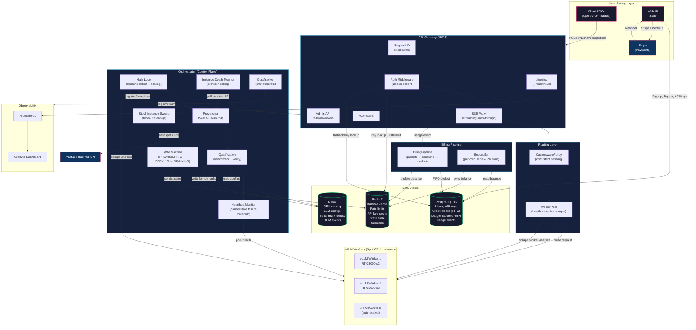
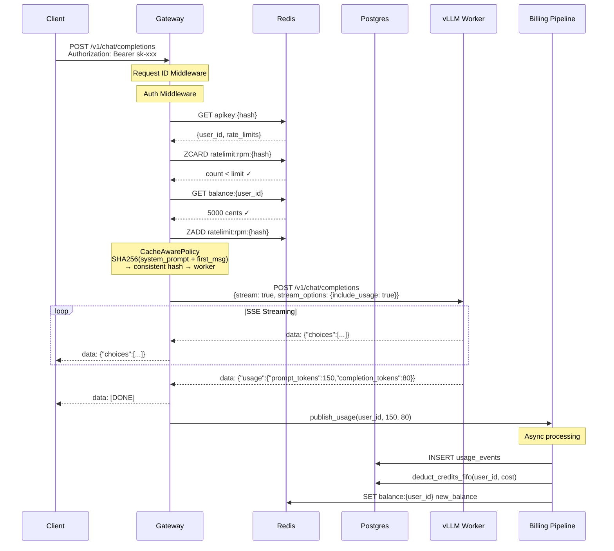
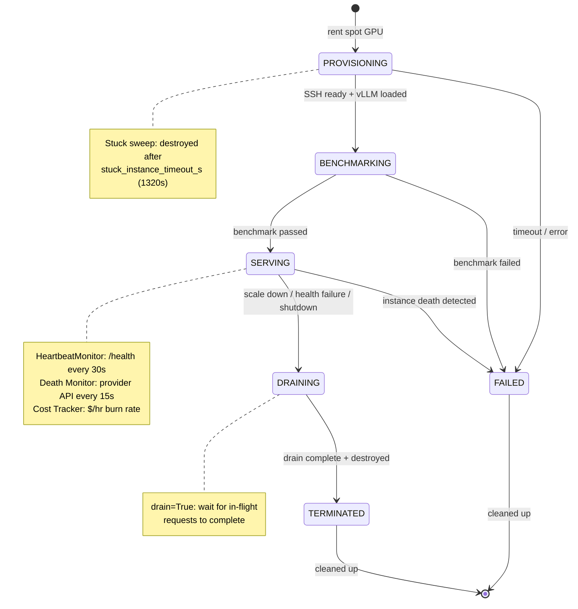
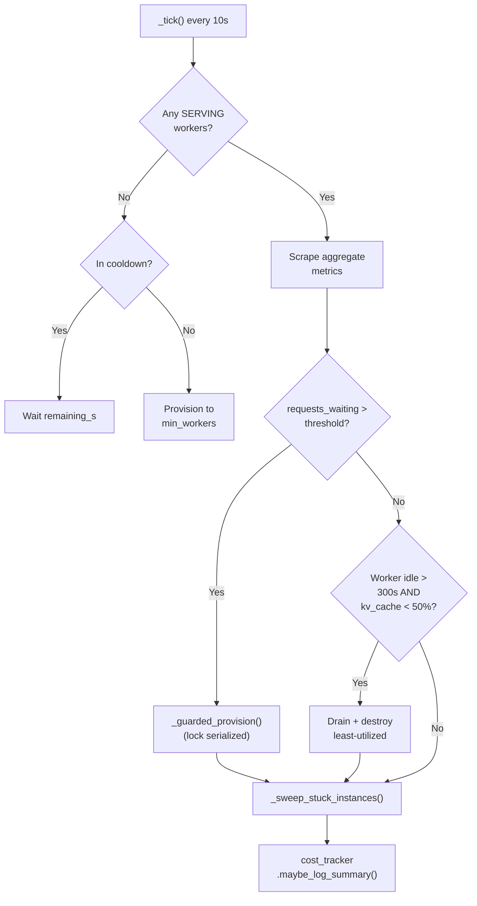
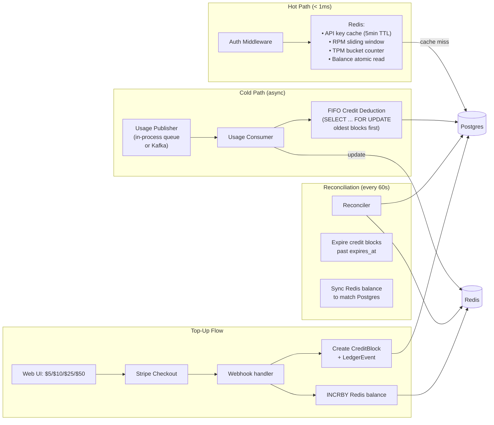
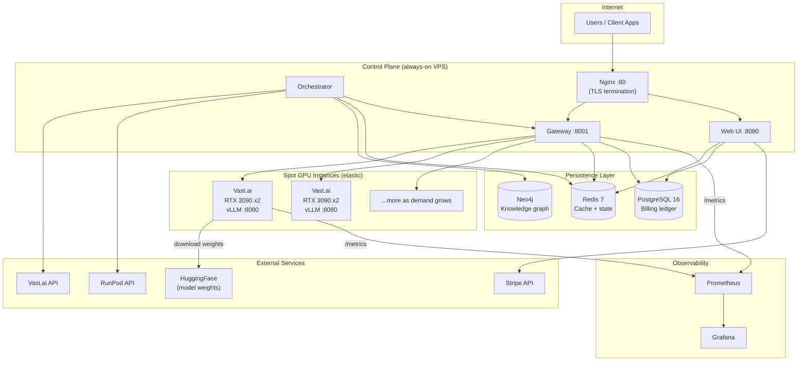

# ShittyToken Production Architecture

## System Overview

## Data Flow: Chat Completion Request

## Instance Lifecycle State Machine

## Scaling Decision Flow

## Billing Architecture

## Infrastructure Topology (Production)

